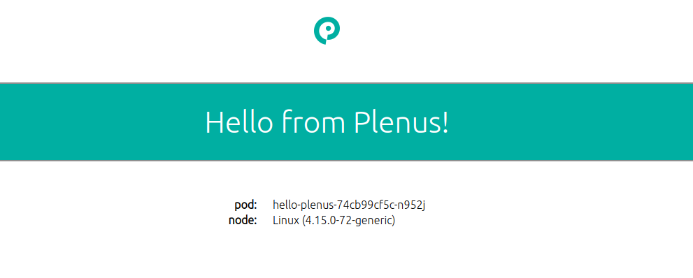

# Hello Kubernetes!

This project is a fork of https://github.com/paulbouwer/hello-kubernetes adapted for the Plenus Cloud
https://plenus.cloud

This container image is intended to be deployed into Plenus Cloud in a new namespace as an example application.
When accessed via a web browser via the chosen hostname, it will display:
- a default **Hello from Plenus!** message
- the pod name
- node os information



The default "Hello from plenus!" message displayed can be overridden using the `MESSAGE` environment variable. The default port of 8080 can be overriden using the `PORT` environment variable.

## DockerHub

It is available on DockerHub as:

- [plenus/hello-plenus:1.0](https://hub.docker.com/r/plenus/hello-plenus/)

## Deploy

### Standard Configuration

Customize the ingress hostname in yaml/hello-ingress.yaml

```yaml
apiVersion: extensions/v1beta1
kind: Ingress
metadata:
  name: hello-plenus
spec:
  backend:
    serviceName: hello-plenus
    servicePort: 80
  rules:
  - host: my.wonderfulcloudapp.com
    http:
      paths:
      - backend:
          serviceName: hello-plenus
          servicePort: 80
        path: /
```

Change my.wonderfulcloudapp.com to the hostname you want to use to access the application.
You will need to create a CNAME record for this name pointing to the name given by the Plenus Cloud for your namespace/cluster.

Deploy to your Kubernetes cluster using the yaml files in yaml/

```bash
$ kubectl apply -f yaml/
```

This will display a **Hello from Plenus!** message when you hit the ingress endpoint in a browser. 


## Build Container Image

If you'd like to build the image yourself, then you can do so as follows. The `build-arg` parameters provides metadata as defined in [OCI image spec annotations](https://github.com/opencontainers/image-spec/blob/master/annotations.md).

Bash
```bash
$ docker build --no-cache --build-arg IMAGE_VERSION="1.8" --build-arg IMAGE_CREATE_DATE="`date -u +"%Y-%m-%dT%H:%M:%SZ"`" --build-arg IMAGE_SOURCE_REVISION="`git rev-parse HEAD`" -f Dockerfile -t "hello-kubernetes:1.8" .
```

Powershell
```powershell
PS> docker build --no-cache --build-arg IMAGE_VERSION="1.8" --build-arg IMAGE_CREATE_DATE="$(Get-Date((Get-Date).ToUniversalTime()) -UFormat '%Y-%m-%dT%H:%M:%SZ')" --build-arg IMAGE_SOURCE_REVISION="$(git rev-parse HEAD)" -f Dockerfile -t "hello-kubernetes:1.8" .
```

## Develop Application

If you have [VS Code](https://code.visualstudio.com/) and the [Visual Studio Code Remote - Containers](https://marketplace.visualstudio.com/items?itemName=ms-vscode-remote.remote-containers) extension installed, the `.devcontainer` folder will be used to build a container based node.js 13 development environment. 

Port `8080` has been configured to be forwarded to your host. If you run `npm start` in the `app` folder in the VS Code Remote Containers terminal, you will be able to access the website on `http://localhost:8080`. You can change the port in the `.devcontainer\devcontainer.json` file under the `appPort` key.

See [here](https://code.visualstudio.com/docs/remote/containers) for more details on working with this setup.
